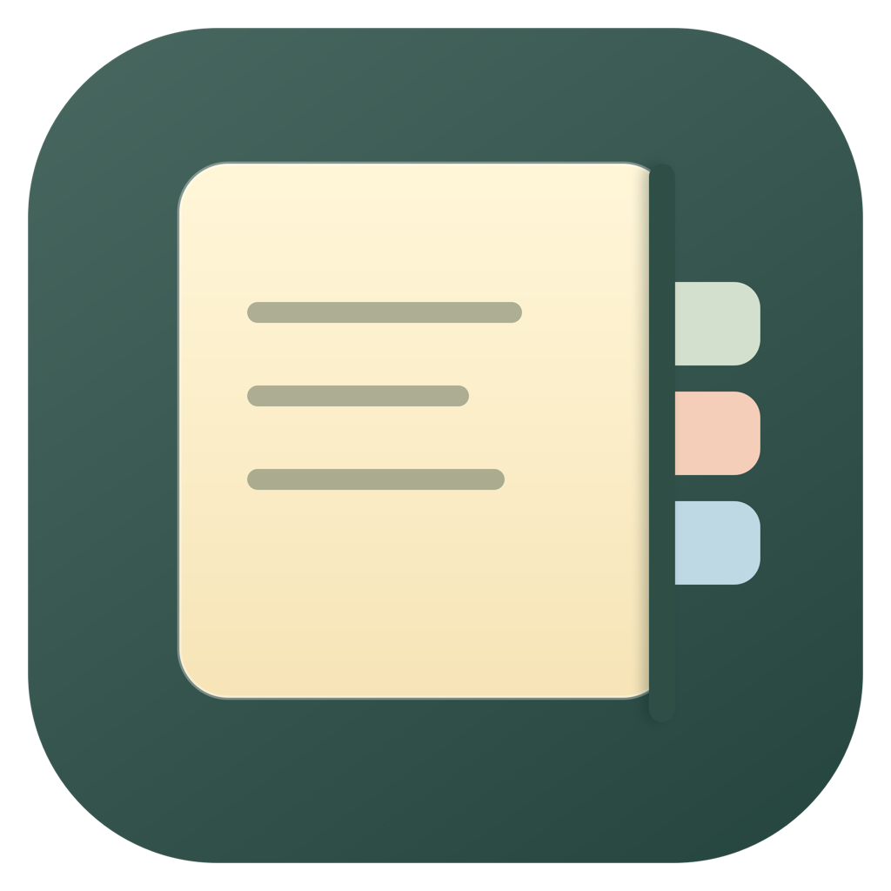

# 틈 · Teum



화면 가장자리에 꽂아두는, 나만의 작은 메모 공간.

SwiftUI + AppKit으로 만든 macOS 네이티브 앱 초안입니다. 계정, 서버, 외부 패키지 없이 동작합니다.

## 실행하기

요구 사항: macOS 14 이상, 빌드 시 Xcode와 Swift 6 이상.

```sh
bash scripts/build-app.sh
open dist/Teum.app
```

`dist/Teum.app`을 Applications 폴더로 옮기면 일반 Mac 앱처럼 사용할 수 있습니다. 현재 빌드한 Mac의 아키텍처로 빌드되며, 로컬 개발용 ad-hoc 서명입니다. 외부 배포용 Developer ID 서명·공증·App Store 설정은 포함하지 않습니다.

설치 후에는 Finder의 **응용 프로그램 → 틈**을 열거나 Spotlight에서 **틈**을 검색해 실행합니다. 실행 중에는 메뉴 막대에 아이콘이 나타납니다. Dock에 아이콘이 없는 것은 메뉴 막대 앱으로 설정했기 때문입니다.

GitHub Release의 ZIP을 내려받은 경우 압축을 풀고 `Teum.app`을 응용 프로그램 폴더로 옮길 수 있습니다. 현재 ZIP은 Apple Silicon용 개발 미리보기이며 Developer ID 서명·공증이 없어 다른 Mac에서는 보안 확인이 나타날 수 있습니다. 일반 사용자에게 매끄럽게 배포하려면 서명·공증 후 새 Release 파일로 교체해야 합니다.

## 사용법

- 화면 가장자리에는 폭 18px의 작은 색상 탭만 남습니다. 마우스를 올린 메모 하나만 80px로 부드럽게 펼쳐져 가로 제목을 보여줍니다. 긴 제목은 말줄임표로 표시됩니다. 펼쳐진 제목 위에서는 유지되고, 벗어나면 접힙니다. 선택된 탭은 얇은 테두리로 구분합니다.
- 탭을 클릭하면 메모가 펼쳐집니다. 같은 탭을 다시 클릭하거나 `Esc`, 패널 하단의 접기 버튼으로 닫습니다.
- `⌃⌥Space`로 마지막으로 보던 메모를 펼치거나 현재 패널을 접습니다. 앱을 완전히 종료하면 마지막 메모 기억은 초기화됩니다.
- `⌃⌥]`는 다음 메모, `⌃⌥[`는 이전 메모로 이동합니다. 탭 순서대로 이동하며 끝에서는 처음으로 이어집니다. 패널이 접혀 있어도 이동할 메모를 펼칩니다. 편집창은 클릭했을 때와 같이 선택한 가장자리 탭 옆에 놓이며, 탭이 스크롤 밖에 있으면 먼저 보이게 이동합니다.
- 앱이 활성화되어 있을 때 `⌘N`은 새 메모를 만들고, `⌘W`는 현재 메모를 삭제합니다. 빈 메모는 확인창 없이 삭제되며, 내용이 있으면 확인을 받습니다. 새 메모의 색상은 현재 가장 아래 메모의 다음 색으로 순환합니다.
- `⌘Z`는 방금 생성하거나 삭제한 메모를 되돌리고, `⌘⇧Z`는 다시 실행합니다. 본문을 편집 중일 때는 글쓰기 실행 취소가 우선합니다. 메모 목록의 실행 취소 기록은 앱을 종료하면 초기화됩니다.
- 단축키가 다른 앱에 점유되어 있으면 메뉴 막대의 이전·다음 메모 항목으로 접근합니다.
- 탭 아래 `+` 또는 편집창 하단의 `+` 버튼으로 메모를 추가합니다. 첫 줄이 탭 제목이 되며 마크다운의 제목·강조 표식은 숨깁니다.
- 아래쪽의 색상 원으로 다섯 가지 종이색을 고릅니다.
- 하단 `…` 메뉴에서 저장 상태·글자 수를 확인하거나 메모를 삭제합니다.
- 메뉴 막대의 틈 아이콘에서 왼쪽/오른쪽 배치, 탭 숨기기, 화면 이동, 저장 폴더 열기, 종료를 선택합니다.
- 메모가 많아지면 탭 영역을 스크롤할 수 있습니다.
- Dock에는 표시되지 않고 메뉴 막대에서 실행됩니다. 로그인 시 자동 실행은 아직 구현하지 않았습니다.

## 마크다운

내용이 있는 메모는 마크다운 서식이 적용된 읽기 화면으로 열립니다. 연필 버튼, 본문 더블클릭 또는 `⌘⇧M`으로 편집합니다. 빈 새 메모는 곧바로 편집할 수 있습니다.

편집 중에도 제목 크기·굵게·기울임·취소선·코드 서식이 실시간 반영됩니다. 문법 기호는 수정할 수 있도록 연하게 표시합니다. 눈 모양 버튼 또는 `⌘⇧M`으로 문법 기호를 숨긴 읽기 화면으로 돌아갑니다. 원문·한글 조합·실행 취소를 유지하도록 네이티브 텍스트 편집기에 표시 속성만 적용합니다.

- `# 제목`부터 `###### 제목`까지의 제목
- `**굵게**`, `*기울임*`, `~~취소선~~`, 인라인 코드와 링크
- `- 항목`, `1. 항목`, 들여쓴 목록
- `- [ ] 할 일`, `- [x] 완료` 체크리스트 표시
- `> 인용문`, `---` 구분선
- 백틱 3개 또는 물결표 3개로 감싼 코드 블록

체크리스트 상태는 원문에서 수정합니다. 메모에 자주 쓰는 문법을 지원하는 경량 미리보기이며, 표·이미지·HTML·코드 구문 강조와 복잡한 중첩 블록은 지원하지 않습니다. 렌더링에 외부 서비스나 웹뷰를 사용하지 않습니다.

## 로컬 저장

`~/Library/Application Support/Teum/notes.json`

입력 후 350ms 뒤 JSON을 원자적으로 교체 저장합니다. 마크다운 원문도 그대로 저장합니다. 패널을 접거나 앱을 종료할 때도 즉시 저장합니다. 파일 읽기에 실패하면 원본을 보존하고 편집을 막습니다. 저장 실패는 패널 하단에 표시되며, 메뉴에서 다시 시도할 수 있습니다. 저장하지 못한 상태로 종료할 때는 경고합니다.

백업은 앱을 종료한 뒤 이 JSON 파일을 복사하면 됩니다. 메모는 평문으로 저장됩니다. 클라우드 동기화와 네트워크 통신은 없습니다.

## 개발

```sh
swift build
swift test
```

Xcode에서는 `Package.swift`를 열어 개발할 수 있습니다. 앱 번들 실행은 위 빌드 스크립트를 사용합니다.

- `Sources/TeumCore`: 메모 모델, 버전이 있는 JSON 저장소, 화면 배치 계산, 마크다운 블록·제목 처리
- `Sources/TeumApp`: 메모 상태와 자동 저장, SwiftUI 화면, AppKit 패널·메뉴·전역 단축키
- `Tests/TeumCoreTests`: 데이터 왕복 저장, 손상·미지원 데이터 보존, 멀티 디스플레이 좌표, 마크다운 블록·코드·제목 검증
- `scripts`: `.app` 패키징과 코드로 그리는 앱 아이콘

실제 메모와 분리한 개발 데이터로 실행하려면:

```sh
TEUM_DATA_DIR=/tmp/teum-dev dist/Teum.app/Contents/MacOS/Teum
```

## 초안의 범위

하나의 화면 가장자리에 여러 메모 탭을 모아두는 구조입니다. 탭을 자유롭게 드래그해서 화면 곳곳에 배치하거나, 여러 메모 패널을 동시에 열거나, 검색·폴더·첨부파일을 추가하는 기능은 다음 단계입니다. 화면 선택은 현재 실행 중에만 유지되고, 왼쪽/오른쪽 설정은 저장됩니다.
